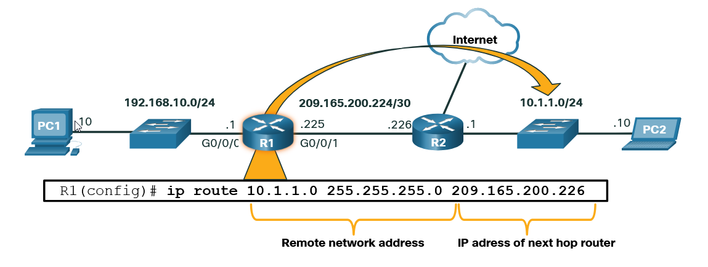

### Terminal type of modes
We can have EXEC Mode, Privileged EXEC Mode, Global Configuration Mode, Interface Configuration.
```bash
# User EXEC Mode
# This is the initial mode after logging in. Limited to basic monitoring commands.
Switch>

# Privileged EXEC Mode
# Provides access to all monitoring commands and some configuration commands. Use 'enable' to enter this mode from User EXEC Mode.
Switch> enable
Switch#

# Global Configuration Mode
# Allows configuration changes to the device. Use 'configure terminal' to enter this mode from Privileged EXEC Mode.
Switch# configure terminal
Switch(config)#

# Interface Configuration Mode
# Used to configure specific interfaces (e.g., VLANs, Ethernet ports). Enter this mode from Global Configuration Mode.
Switch(config)# interface vlan 1
Switch(config-if)#

# Line Configuration Mode
# Used to configure console, AUX, and VTY (Telnet/SSH) lines. Enter this mode from Global Configuration Mode.
Switch(config)# line console 0
Switch(config-line)#

# To return to Global Configuration Mode from a sub-mode (e.g., Interface or Line Configuration Mode)
Switch(config-if)# exit
Switch(config)#

# To return to Privileged EXEC Mode from Global Configuration Mode
Switch(config)# exit
Switch#

# To return to User EXEC Mode from Privileged EXEC Mode
Switch# disable


```

### Configure Hostname
```bash
Switch# configure terminal
Switch(config)# hostname Sw-Floor-1
Sw-Floor-1(config)#
```

### Set Password
```bash
Sw-Floor-1# configure terminal
Sw-Floor-1(config)# line console 0
Sw-Floor-1(config-line)# password cisco
Sw-Floor-1(config-line)# login
SW-Floor-1(config-line)# end
Sw-Floor-1#
```

To secure privileged EXEC access, use the **enable secret** _password_ global config command:
```bash
Sw-Floor-1# configure terminal
Sw-Floor-1(config)# enable secret class
Sw-Floor-1(config)# exit
Sw-Floor-1#
```

### Configure VTY Lines
Virtual terminal (VTY) lines allow remote access through Telnet or SSH to the device:
```bash
Sw-Floor-1# configure terminal
Sw-Floor-1(config)# line vty 0 15
Sw-Floor-1(config-line)# password cisco 
Sw-Floor-1(config-line)# login 
Sw-Floor-1(config-line)# end
Sw-Floor-1#
```

### Encrypt Passwords
Startup-config and running-config files show most passwords in plain text, which is a security threat. Use the following command to encrypt passwords:
```bash
Sw-Floor-1# configure terminal
Sw-Floor-1(config)# service password-encryption
Sw-Floor-1(config)#
```

Use the **show running-config** command to verify that the passwords are now encrypted:
```bash
SW-Floor-1(config)# end
Sw-Floor-1# show running-config
!

!
line con 0
password 7 094F471A1A0A
login
!
line vty 0 4
password 7 03095A0F034F38435B49150A1819
login
!
!
end
```

### Warning Messages
Set up a warning message using the banner command:
```bash
Sw-Floor-1# configure terminal
Sw-Floor-1(config)# banner motd #Authorized Access Only !#
```

### Configuration Files

- **startup-config**: This is the saved configuration file stored in NVRAM. It contains all the commands that the device will use on startup or reboot. Flash does not lose its content when the device is powered off.
- **running-config**: This is stored in Random Access Memory (RAM). It reflects the current configuration. Modifying a running configuration affects the operation of a Cisco device immediately. RAM is volatile and loses all content when the device is powered off or restarted.

To save the running configuration to the startup configuration:
```bash
copy running-config startup-config
```

### Modify Running Configuration
Use the **reload** command to remove a configuration:
```bash
reload
```

To erase the startup configuration:
```bash
erase startup-config
```

### Manual IP Address Configuration for End Devices

#### Configure Switch Virtual Interface
```bash
Sw-Floor-1# configure terminal
Sw-Floor-1(config)# interface vlan 1
Sw-Floor-1(config-if)# ip address 192.168.1.20 255.255.255.0
Sw-Floor-1(config-if)# no shutdown
Sw-Floor-1(config-if)# exit
Sw-Floor-1(config)# ip default-gateway 192.168.1.1
```
### Static Routing

R1 is manually configured with a static route to reach the 10.1.1.0/24 network. If this path changes, R1 will require a new static route.
```bash 
ip route 10.1.1.0 255.255.255.0 209.165.200.226
```
### Basic Steps in Configuring a Router

#### Configure Hostname
```bash
Router(config)# hostname R1
```

#### Secure the Privileged EXEC Mode
```bash
Router(config)# enable secret class
```

#### Secure the User EXEC Mode
```bash
Router(config)# line console 0  
Router(config-line)# password cisco 
Router(config-line)# login
```

#### Secure Remote Access via Telnet and SSH
```bash
Router(config)# line vty 0 4  
Router(config-line)# password cisco
Router(config-line)# login  
Router(config-line)# transport input {ssh | telnet}
```

#### Protect All Passwords in the Configuration File
```bash
Router(config-line)# exit  
Router(config)# service password-encryption
```

#### Provide a Legal Notification
```bash
Router(config)# banner motd #Authorized Access Only !#
```

#### Save the Configuration
```bash
Router(config)# end  
Router# copy running-config startup-config
```

### Configuring Router Interfaces

At this point, the routers have their basic configurations. The next step is to configure their interfaces because end devices cannot reach the routers until the interfaces are configured. There are many different types of interfaces for Cisco routers. For example, the Cisco ISR 4321 router is equipped with two Gigabit Ethernet interfaces:

- GigabitEthernet 0/0/0 (G0/0/0)
- GigabitEthernet 0/0/1 (G0/0/1)

Configuring a router interface is very similar to configuring a management SVI on a switch. Specifically, it involves issuing the following commands:

```bash
Router(config)# interface type-and-number #example: interface s0/0/0 
Router(config-if)# description description-text  
Router(config-if)# ip address 192.68.101.2 255.255.255.0
Router(config-if)# ipv6 address ipv6-address/prefix-length  
Router(config-if)# no shutdown
```

Example:
```bash
R1> enable
R1# configure terminal
Enter configuration commands, one per line.
End with CNTL/Z.
R1(config)# interface gigabitEthernet 0/0/0
R1(config-if)# description Link to LAN
R1(config-if)# ip address 192.168.10.1 255.255.255.0
R1(config-if)# ipv6 address 2001:db8:acad:10::1/64
R1(config-if)# no shutdown
R1(config-if)# exit
R1(config)#
*Aug  1 01:43:53.435: %LINK-3-UPDOWN: Interface GigabitEthernet0/0/0, changed state to down
*Aug  1 01:43:56.447: %LINK-3-UPDOWN: Interface GigabitEthernet0/0/0, changed state to up
*Aug  1 01:43:57.447: %LINEPROTO-5-UPDOWN: Line protocol on Interface GigabitEthernet0/0/0, changed state to up
R1(config)#
R1(config)# interface gigabitEthernet 0/0/1
R1(config-if)# description Link to R2
R1(config-if)# ip address 209.165.200.225 255.255.255.252
R1(config-if)# ipv6 address 2001:db8:feed:224::1/64
R1(config-if)# no shutdown
R1(config-if)# exit
R1(config)#
*Aug  1 01:46:29.170: %LINK-3-UPDOWN: Interface GigabitEthernet0/0/1, changed state to down
*Aug  1 01:46:32.171: %LINK-3-UPDOWN: Interface GigabitEthernet0/0/1, changed state to up
*Aug  1 01:46:33.171: %LINEPROTO-5-UPDOWN: Line protocol on Interface GigabitEthernet0/0/1, changed state to up
R1(config)#
```

Verify the configuration:
```bash
show ip interface brief
```

```bash
R1# show ip interface brief
Interface              IP-Address      OK? Method Status                Protocol
GigabitEthernet0/0/0   192.168.10.1    YES manual up                    up
GigabitEthernet0/0/1   209.165.200.225 YES manual up                    up
Vlan1                  unassigned      YES unset  administratively down down

R1# show ipv6 interface brief
GigabitEthernet0/0/0 [up/up]
    FE80::201:C9FF:FE89:4501
    2001:DB8:ACAD:10::1
GigabitEthernet0/0/1 [up/up]
    FE80::201:C9FF:FE89:4502
    2001:DB8:FEED:224::1
Vlan1 [administratively down/down]
    unassigned
```
### Configuration Verification Commands
Popular show commands used to verify interface configuration.

#### Show ip interface brief
```bash
R1# show ip interface brief
Interface              IP-Address      OK? Method Status                Protocol 
GigabitEthernet0/0/0   192.168.10.1    YES manual up                    up 
GigabitEthernet0/0/1   209.165.200.225 YES manual up                    up 
Vlan1                  unassigned      YES unset  administratively down down 
R1#
```
#### Show ipv6 interface brief
```bash
show ipv6 interface brief
```
```bash
R1# show ipv6 interface brief
GigabitEthernet0/0/0       [up/up]
    FE80::201:C9FF:FE89:4501
    2001:DB8:ACAD:10::1
GigabitEthernet0/0/1       [up/up]
    FE80::201:C9FF:FE89:4502
    2001:DB8:FEED:224::1
Vlan1                      [administratively down/down]
    unassigned 
R1#
```
#### Show ip route
Codes of ip routers
```bash
Codes: L - local, C - connected, S - static, R - RIP, M - mobile, B - BGP
       D - EIGRP, EX - EIGRP external, O - OSPF, IA - OSPF inter area 
       N1 - OSPF NSSA external type 1, N2 - OSPF NSSA external type 2
       E1 - OSPF external type 1, E2 - OSPF external type 2
       i - IS-IS, su - IS-IS summary, L1 - IS-IS level-1, L2 - IS-IS level-2
       ia - IS-IS inter area, * - candidate default, U - per-user static route
       o - ODR, P - periodic downloaded static route, H - NHRP, l - LISP
       a - application route
       + - replicated route, % - next hop override, p - overrides from PfR
```
```bash
show ip route
```
```bash
R1# show ip route
Gateway of last resort is not set
      192.168.10.0/24 is variably subnetted, 2 subnets, 2 masks
C        192.168.10.0/24 is directly connected, GigabitEthernet0/0/0
L        192.168.10.1/32 is directly connected, GigabitEthernet0/0/0
      209.165.200.0/24 is variably subnetted, 2 subnets, 2 masks
C        209.165.200.224/30 is directly connected, GigabitEthernet0/0/1
L        209.165.200.225/32 is directly connected, GigabitEthernet0/0/1
R1#
```
#### Show ipv6 route
```bash
show ipv6 route
```
```bash
R1# show ipv6 route
IPv6 Routing Table - default - 5 entries
Codes: C - Connected, L - Local, S - Static, U - Per-user Static route
       B - BGP, R - RIP, H - NHRP, I1 - ISIS L1
       I2 - ISIS L2, IA - ISIS interarea, IS - ISIS summary, D - EIGRP
       EX - EIGRP external, ND - ND Default, NDp - ND Prefix, DCE - Destination
       NDr - Redirect, RL - RPL, O - OSPF Intra, OI - OSPF Inter
       OE1 - OSPF ext 1, OE2 - OSPF ext 2, ON1 - OSPF NSSA ext 1
       ON2 - OSPF NSSA ext 2, a - Application
C   2001:DB8:ACAD:10::/64 [0/0]
     via GigabitEthernet0/0/0, directly connected
L   2001:DB8:ACAD:10::1/128 [0/0]
     via GigabitEthernet0/0/0, receive
C   2001:DB8:FEED:224::/64 [0/0]
     via GigabitEthernet0/0/1, directly connected
L   2001:DB8:FEED:224::1/128 [0/0]
     via GigabitEthernet0/0/1, receive
L   FF00::/8 [0/0]
     via Null0, receive
```
#### Show interfaces 
```bash
show interfaces gig0/0/0
```
```bash
R1# show interfaces gig0/0/0
GigabitEthernet0/0/0 is up, line protocol is up 
  Hardware is ISR4321-2x1GE, address is a0e0.af0d.e140 (bia a0e0.af0d.e140)
  Description: Link to LAN
  Internet address is 192.168.10.1/24
  MTU 1500 bytes, BW 100000 Kbit/sec, DLY 100 usec, 
     reliability 255/255, txload 1/255, rxload 1/255
  Encapsulation ARPA, loopback not set
  Keepalive not supported 
  Full Duplex, 100Mbps, link type is auto, media type is RJ45
  output flow-control is off, input flow-control is off
  ARP type: ARPA, ARP Timeout 04:00:00
  Last input 00:00:01, output 00:00:35, output hang never
  Last clearing of "show interface" counters never
  Input queue: 0/375/0/0 (size/max/drops/flushes); Total output drops: 0
  Queueing strategy: fifo
  Output queue: 0/40 (size/max)
  5 minute input rate 0 bits/sec, 0 packets/sec
  5 minute output rate 0 bits/sec, 0 packets/sec
     1180 packets input, 109486 bytes, 0 no buffer
     Received 84 broadcasts (0 IP multicasts)
     0 runts, 0 giants, 0 throttles 
     0 input errors, 0 CRC, 0 frame, 0 overrun, 0 ignored
     0 watchdog, 1096 multicast, 0 pause input
     65 packets output, 22292 bytes, 0 underruns
     0 output errors, 0 collisions, 2 interface resets
     11 unknown protocol drops
     0 babbles, 0 late collision, 0 deferred
     1 lost carrier, 0 no carrier, 0 pause output
     0 output buffer failures, 0 output buffers swapped out
R1#
```

#### IPv4 Routing Table
```bash
netstat -r 
```
```bash
netstat -r
IPv4 Route Table
===========================================================================
Active Routes:
Network Destination         Netmask       Gateway       Interface    Metric
          0.0.0.0           0.0.0.0   192.168.10.1   192.168.10.10       25
        127.0.0.0         255.0.0.0       On-link        127.0.0.1      306
        127.0.0.1   255.255.255.255       On-link        127.0.0.1      306
  127.255.255.255   255.255.255.255       On-link        127.0.0.1      306
     192.168.10.0     255.255.255.0       On-link    192.168.10.10      281
    192.168.10.10   255.255.255.255       On-link    192.168.10.10      281
   192.168.10.255   255.255.255.255       On-link    192.168.10.10      281
        224.0.0.0         240.0.0.0       On-link        127.0.0.1      306
        224.0.0.0         240.0.0.0       On-link    192.168.10.10      281
  255.255.255.255   255.255.255.255       On-link        127.0.0.1      306
  255.255.255.255   255.255.255.255       On-link    192.168.10.10      281
```
### ARP Tables on Networking Devices
```bash
Router# show ip arp
```
```bash
PC01# arp -a
```
```bash
R1# show ip arp
Protocol  Address          Age (min)  Hardware Addr   Type   Interface
Internet  192.168.10.1            -   a0e0.af0d.e140  ARPA   GigabitEthernet0/0/0
Internet  209.165.200.225         -   a0e0.af0d.e141  ARPA   GigabitEthernet0/0/1
Internet  209.165.200.226         1   a03d.6fe1.9d91  ARPA   GigabitEthernet0/0/1
R1#
```